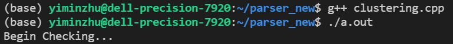

# 4FPGA

## Algorithm

| Step | Time | Space | Parallized |
| --------------- | --------------- | --------------- | --------------- |
| Get Queue | O(# neighbour nodes) | O(n) | True |
| Get Cluster | O(\|E\|) | O(n) | False |
| Get Clustered Nodes | O(n) | O(m) | False |
| Get Sorted Clustered Nodes | O(m) | O(m) | False |
| Get Edge Pairs | O(m^2) | O(m^2) | True with larger memory requirement |
| Get Scaled Feature | O(m) | O(m) | True |

### Note
1. n: \# nodes; m: \# clustered nodes
2. *get queue* is to check whether all nodes are neighbours or not in O(1), and then sequencially add valid nodes to queue. Inspired by [Synthesize High Speed Leading Zero Count ](https://electronics.stackexchange.com/questions/196914/verilog-synthesize-high-speed-leading-zero-count), we can find the first valid node in queue in O(1). Hence, the total time is O(1) \* # neighbour nodes = O(# neighbour nodes). It will be implemented in FPGA and get parallelized.
3. For *get cluster*, it used the node with smallest id in a cluster as the root and use BFS to find the whole cluster sequencially. The time it takes is sum of O(# neighbour nodes) for all nodes, which is O(|E|). Although O(|E|) has the worst case of O(n^2),  the complexity is much smaller since the graph is sparse.
5. The *x*, *y*, *z* of a clustered node is the average of all nodes in this cluster.
6. Creteria of selecting edge pair is to have *phi slope* < 0.100 and *z0* < 200.
7. The scaled feature are saved in *output* with length of *num_clusters*

## Validation
### Data
* D0toPiKInAcceptanceSignal_Iteration8_10000.cfg_HFMLTriggerInterface.json.bz2
* \# Events: 1000
### Result
1. The clusters are the same for the 1000 events.

2. The number of edges varies for different events. Note that the difference is small (within +- 3 edges) which indicates the high similarity between the two generated edge sets.

*Example: Event 14*

| Set | (r phi z) (r phi z) | phi slope | z0 | Included? |
| --------------- | --------------- | --------------- | --------------- | --------------- |
| New | (2.566 2.510 6.377) (3.464 2.599 -2.516) | 0.099952 | 31.784 | YES |
| Old | (2.56688 2.50902 6.37650) (3.46450 2.59933 -2.51550) | 0.10062 | 31.80459 | **NO** since 0.10062 > 0.1 |

## Log
* Fix the error in original python code: change *-2* to *+2*.
