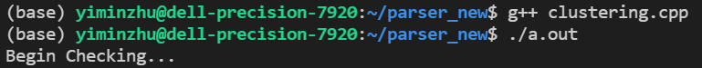

# 4FPGA

## Algorithm

| Step | Time | Space | Parallized |
| --------------- | --------------- | --------------- | --------------- |
| Get Adjancy Matrix | O(n) | O(n^2) | True |
| Get Adjancy List | O(n) | O(n^2) | True |
| Get Cluster | O(\|E\|) | O(n) | False |

### Note
1. Time complexity of *get adjancy matrix* and *get adjancy list* is O(n) due to parallelism. Otherwise O(n^2).
2. The space for adjancy matrix is reused for adjancy list. Hence, O(n) instead of 2O(n).
3. For *get cluster*, it used the node with smallest id in a cluster as the root and use BFS to find the whole cluster sequencially. Although the time is bounded by O(|E|) which has the worst case of O(n^2), since the graph is usually sparse, the complexity is much smaller.

## Validation
### Data
* D0toPiKInAcceptanceSignal_Iteration8_10000.cfg_HFMLTriggerInterface.json.bz2
* \# Events: 1000
### Result
The clusters are the same for the 1000 events.

## Log
* Fix the error in original python code: change *-2* to *+2*.
